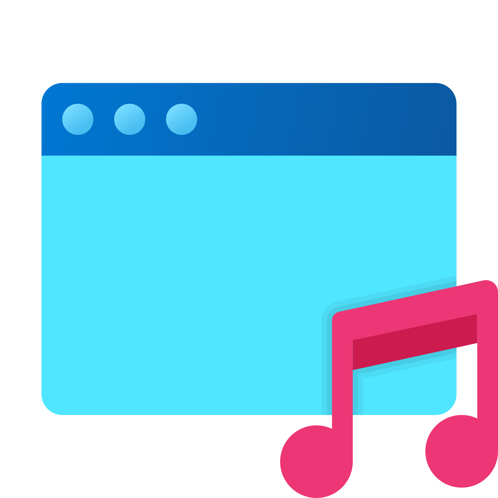
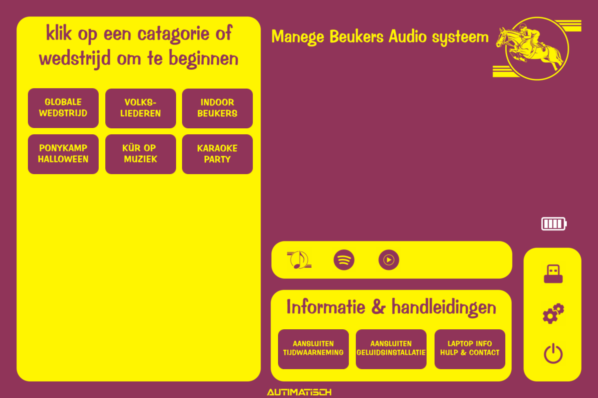

<!-- PROJECT SHIELDS -->
<!--
*** I'm using markdown "reference style" links for readability.
*** Reference links are enclosed in brackets [ ] instead of parentheses ( ).
*** See the bottom of this document for the declaration of the reference variables
*** for contributors-url, forks-url, etc. This is an optional, concise syntax you may use.
*** https://www.markdownguide.org/basic-syntax/#reference-style-links
-->

<!-- PROJECT LOGO -->
 

  

<h3 align="center">Autimatisch Audio system</h3>

  

    Het audiosysteem van Autimatisch - ontwikkeld voor Manege Beukers
     
    <a href="https://github.com/Autimatisch/Autimatisch-Audio-system"><strong>Wiki & handleidingen »</strong></a>
     
     
    <a href="https://github.com/Autimatisch/Autimatisch-Audio-system/issues">Fout melden</a>
    ·
    <a href="https://github.com/Autimatisch/Autimatisch-Audio-system/issues">Idee geven</a>
  

<!-- ABOUT THE PROJECT -->
## Over het project

  

Bij manege beukers werd gebruik gemaakt van een ingewikkeld muziek programma waar bijna niemand verstand van had. Omdat dit natuurlijk niet gebruiksvriendelijk is heb ik dit nieuwe systeem ontwikkeld wat extra simpel is in het gebruik. Zo kan iedereen de muziek aanzetten en bedienen.

<!-- GETTING STARTED -->
## Installeren

Er komt binnenkort een iso uit om het audio systeem op een apparaat te installeren. 

### vereisten

Microsoft Surface go
USB stick (8gb of meer)
een laptop met windows 10 of hoger
rufus [https://rufus.ie/nl/](Downloaden)

### Installatie
(Technische kennis is vereist.)

1. Download de ISO vanaf de [https://github.com/Autimatisch/Autimatisch-Audio-system/releases](releases) pagina 
2. Download [https://rufus.ie/nl/](rufus)
3. Installeer de ISO via rufus op een USB stick
4. Doe de USB in de surface en boot naar de USB.
5. Volg de installatiestappen van Windows

We raden aan om na het installeren, op instellingen te klikken en het programma "Updates" te openen om te zorgen dat u altijd de nieuwste update heeft.

<!-- ROADMAP -->
## Ideeen om toe te voegen
- [ ] Detectie of de geluidsinstallatie is aangesloten
- [ ] doorklikbare handleidingen
- [ ] beheeromgeving beukers radio
- [ ] instream functionaliteit -> bijvoorbeeld spotify naar de laptop kunnen streamen (laptop moet zich voordoen als chromecast)
- [ ] Verbeterde wifi instellingen (keuzelijst met wifi punten ipv windows settings openen)
- [ ] verbeterde functionaliteit van het laden van de windows personal config (thema-achtergrondkleur)
- [ ] interface voor de handleidingen (is nu een winexplorer folder)
- [ ] Meer build-in applicaties (youtube, apple music, etc)

**Klaar/toegevoegd**
- [ ] <a href="https://github.com/Autimatisch/Autimatisch-Audio-system/blob/master/images/instellingen.png">instellingen/beheer menu</a>
- [ ] Beukers Radio ontvanger (app op startscherm)
- [ ] Update checker, laat zien welke versie is geinstalleerd en wat de meest recent beschikbare versie is

**Verwijderd/gecanceld**
- [ ] UpdateTool -> weigerde meer dan 1 mp3 bestand per sessie te downloaden. Word binnenkort vervangen voor een alternatief
- [ ] WindowsUpdateChecker -> uitgeschakeld, zorgde ervoor dat het touchscreen interface vast liep
- [ ] Hulp op afstand knop -> werd gebruikt om windows quick assist te openen. is vervangen voor software waarbij er direct kan worden meegekeken zonder eerst een code in te moeten vullen.
- [ ] "Kur op muziek" functie -> had 2 schermen nodig wat niet handig is bij regelmatig gebruik. word vervangen voor alternatief.
